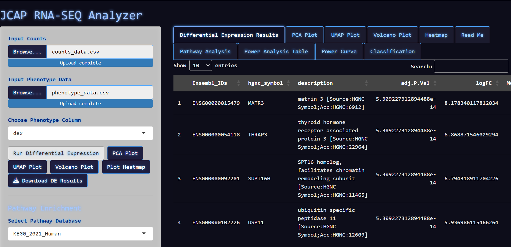
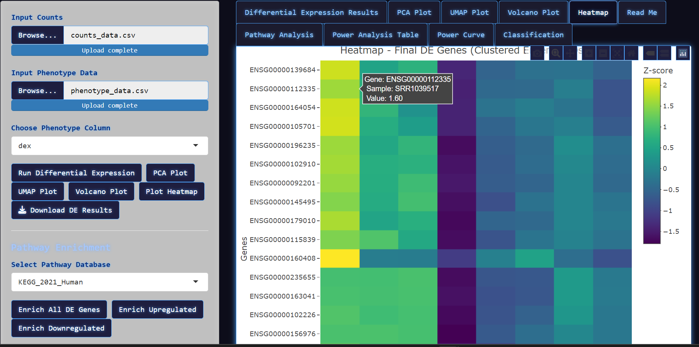
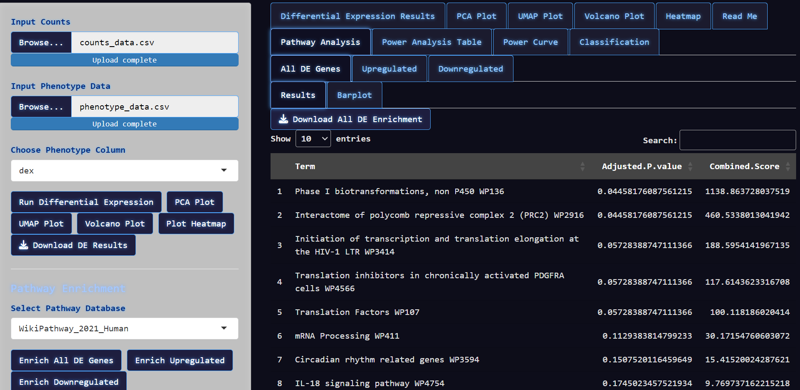

# 🧬 JCAP RNA-SEQ ANALYZER

An interactive **R Shiny** web app for RNA-seq analysis — integrating differential expression, power estimation, feature selection (Random Forest), dimensionality reduction, and pathway enrichment in one clean UI.


> **Built for bioinformatics teams, core facilities, and HPC environments.**  
> **No coding required. Fully Docker / Apptainer / Singularity compatible.**

---

## 🚀 Features

- 📂 Upload expression matrix + phenotype file
- 🧬 Differential expression (`limma-voom`)
- 🌌 PCA + UMAP projections
- 🌋 Volcano plot
- 🌲 Random Forest + classifier metrics
- 📊 Functional enrichment (via `enrichR`)
- 📈 Power analysis & power curve
- 📉 ROC + AUC visualizations
- 📥 Downloadable results + logs
- 🧠 Error tracking via `error_log.txt`
- 🐳 Docker + Singularity + Apptainer support
- 📄 Embedded readme tab inside the app

---
---

## 🖼️ Screenshots

### Differential Expression Results
Shows the top DEGs with Ensembl ID, gene symbol, description, p-value, logFC, and RF score.



---

### Heatmap (Z-scored)
Clustered heatmap of top DEGs across all samples.



---

### Pathway Enrichment Table
Enriched terms for selected genes (EnrichR).



---

### Enrichment Barplot (Interactive)
Top terms visualized with -log10 adjusted P-values.


## 📁 Folder Structure

```txt
RNA_SEQ_APP/
├── app.R                     # Main Shiny app
├── run.sh                   # Docker run script
├── Dockerfile               # Docker image definition
├── Singularity.def          # Apptainer/Singularity container
├── Makefile                 # Build & run helper (Docker/SIF)
├── email_log.R              # Error email script
├── error_log.txt            # Runtime error log (auto-generated)
├── JCAP RNA_SEQ Readme.txt  # Embedded app readme (in-app)
└── www/
    └── Arcane_Alchemy_Theme.css

⚙️ Deployment Options
🐳 Run Locally with Docker

git clone https://github.com/your-user/RNA_SEQ_APP.git
cd RNA_SEQ_APP
bash run.sh
Open your browser at: http://localhost:8787

🧬 Run on HPC with Singularity or Apptainer
singularity build rna-seq.sif Singularity.def

apptainer build rna-seq.sif Singularity.def

Run:

singularity run --bind $(pwd):/mnt rna-seq.sif
# or
apptainer run --bind $(pwd):/mnt rna-seq.sif

Port Forward (if remote cluster):


ssh -L 8080:localhost:8080 youruser@cluster

Open in browser: http://localhost:8080

🛠️ Using the Makefile
A Makefile is included to automate builds and runs:

Command	Description
make	Show help info
make docker	Build Docker image
make run	Run app using Docker (localhost:8787)
make run-dev	Run with local bind-mount for dev mode
make sif	Build Singularity image
make apptainer	Build Apptainer image
make run-sif	Run SIF interactively
make clean	Remove Docker image + SIF
📊 UI Tabs & Outputs
Tab	Description
Differential Expression	Top 50 DEGs + annotation + RF importance
PCA / UMAP Plots	Interactive projections of sample space
Volcano Plot	logFC vs -log10 P-adj with thresholds
Heatmap	Z-score clustered DE gene heatmap
Pathway Enrichment	Enrichr (All / Up / Down genes)
Power Summary / Curve	Power tables + curve from pwr package
Classification	RF model performance, predictions, ROC curve
Read Me	Rendered version of JCAP RNA_SEQ Readme.txt
🔁 Processing Workflow
t\
Counts + Phenotype
        ↓
Differential Expression (limma-voom)
        ↓
Top 50 DEGs → RF Feature Selection (Top 20)
        ↓
Classifier Training (Train/Test Split)
        ↓
Optional Enrichment (All / Up / Down)
        ↓
Dimensionality Reduction (PCA / UMAP)
        ↓
Visualization & Power Analysis

🧠 Tech Stack


R / Shiny

limma, edgeR, biomaRt, enrichR

randomForest, caret, pROC, pwr

umap, ggplot2, plotly

Docker, Singularity, Apptainer

Email alerts, Error logging, Makefile automation

📥 Downloadable Outputs

File	Description
DE_results_*.csv	Final DEGs with annotation + RF scores
enrichment_all.csv	All DEGs enrichment
enrichment_upregulated.csv	Upregulated gene enrichment
enrichment_downregulated.csv	Downregulated gene enrichment
rf_predictions.csv	Predictions table
rf_metrics.csv	Sensitivity, specificity, AUC
power_summary.csv	Power analysis summary

summary
📧 Error Monitoring (Optional)
Errors are auto-logged to error_log.txt.

You can schedule daily error emails via cron:

cron


📢 Feedback / Contributions
🐛 GitHub Issues
0 0 * * * Rscript /path/to/email_log.R

💡 Feature suggestions and PRs welcome

RNA-seq shouldn’t feel like black magic.
🧙‍♂️ JCAP RNA-SEQ ANALYZER turns your data into insights — fast, reproducibly, and interactively


